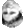
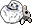
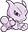
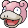
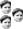
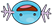
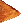
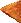

# Secret Dungeon Emotes for Twitch.tv
A set of cool (in-joke) emoticons that you can use anywhere on **[Twitch](http://www.twitch.tv)**. They are born out of small communities created from Twitch's Group Chats functionality -- or as we like to refer to them, "dungeons".

Scroll down for installation instructions.

## What you get

We are continually adding new cool emoticons to our list! Right now, we have the following:

**Last updated: May 23rd, 2016**

*  appaK
*  Breject
*  CurtainKapp
*  Cursenpai
*  DekuYay
*  ElecGiggle
*  ElectriKapp
*  FeelingIt
*  FogChamp
*  ForeverAron
*  HateChatot
*  JoltikZ
*  LoveBlaziken
*  LoveChatot
*  MlneBoom
*  NeckTube
*  OoohKaz
*  PagChomp
*  PutainRage
*  RateSnog
*  SlowpieOP
*  SerenaFish
*  TipScales
*  TriKapp
*  WooperZ
*  ZrepooW

In addition to some dorito emoticons:
*  drU
*  drR
*  drD
*  drL

And even a couple secret (unlisted) emoticons. :)

## Promote the script

Spread the script to your Twitch friends by using this URL: **[bit.ly/sdemotes](http://bit.ly/sdemotes)**

## How to install

### Google Chrome extension

If you use Google Chrome, simply **[install Secret Dungeon Emotes via this handy link!](http://chrome.google.com/webstore/detail/secret-dungeon-emotes/fljimgaiflbdcihhihlmccpdfnlcedcm)**

### User script

If you use Greasemonkey, Tampermonkey, etc, this is the URL to [the script](http://graulund.github.io/secretdungeonemotes/dungeonemotes.user.js):

`http://graulund.github.io/secretdungeonemotes/dungeonemotes.user.js`

### Bookmark

If not, you can install it via a bookmark.

1. Go to the bookmark menu of your browser and add a new bookmark with the title of your choice.
2. Copy the following snippet and paste it into the URL field: `javascript:(function(){document.body.appendChild(document.createElement('script')).src='http://graulund.github.io/secretdungeonemotes/dungeonemotes.user.js';})();`
3. Save the Bookmark.

From now on, you can just click on that bookmark when you have the Twitch tab open to enable the script.

Cheers!
